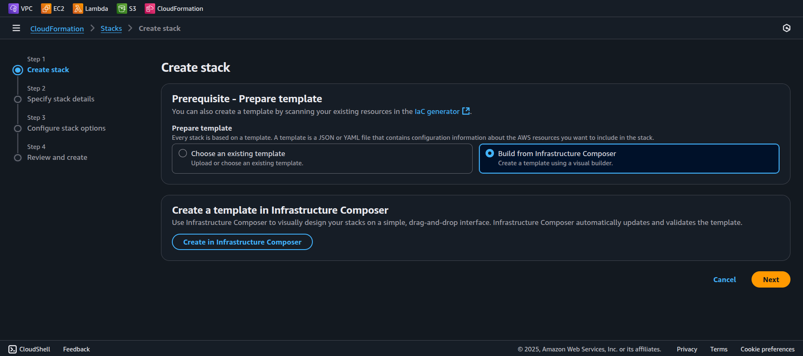
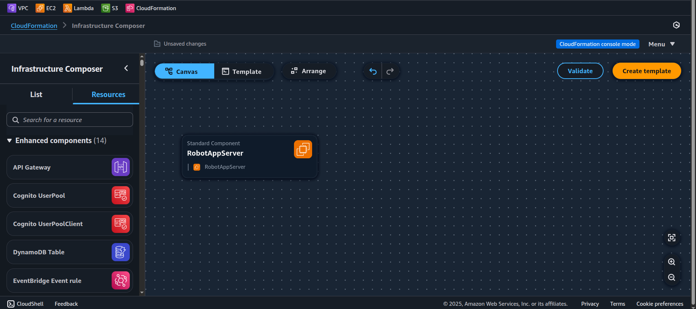
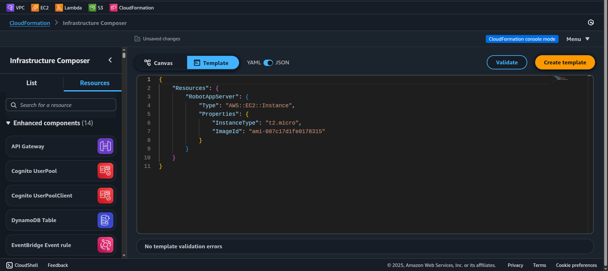
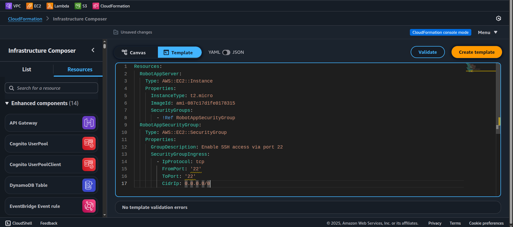
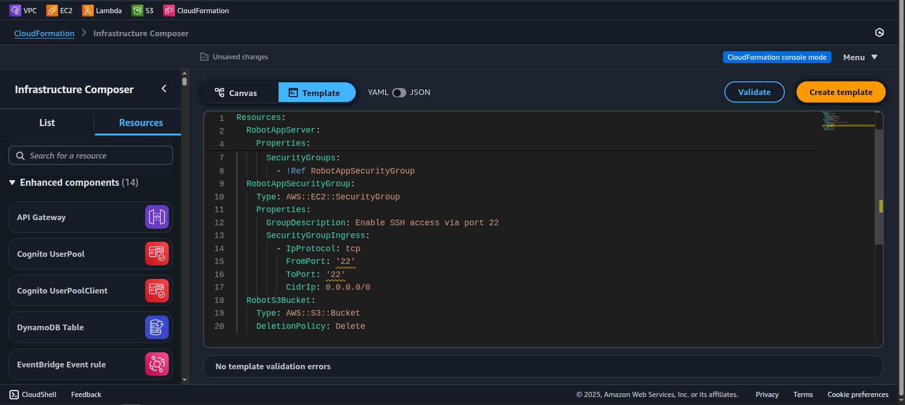
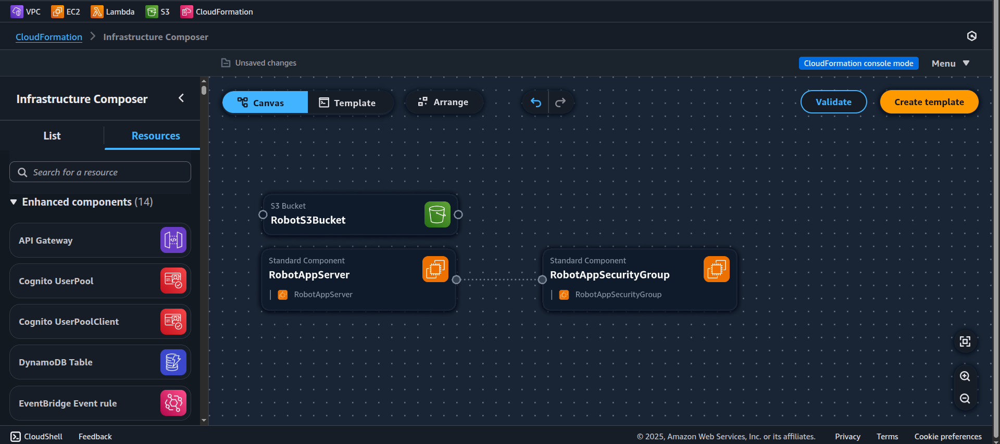
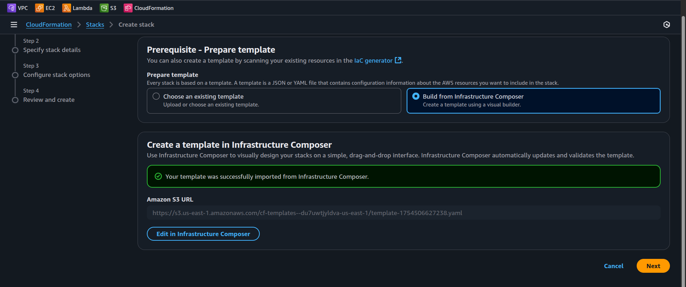
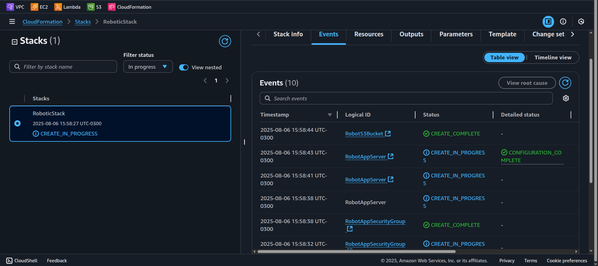
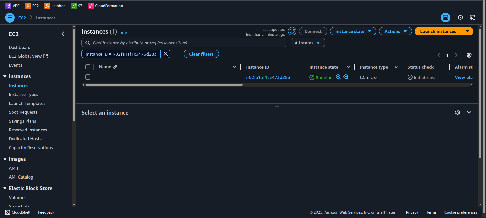
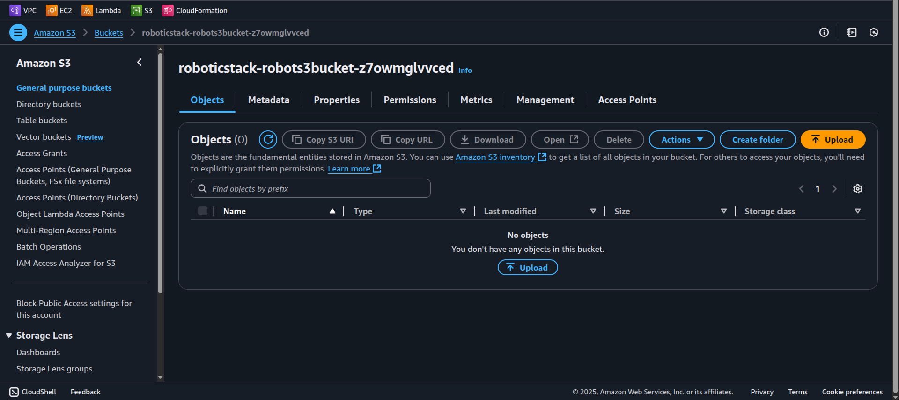

# 🏗️ Proyecto: CloudFormation Test Template

Este proyecto despliega de forma automática una **instancia EC2** y un **bucket S3** utilizando un **template básico de AWS CloudFormation**.

---

## 🎯 Objetivo

- Crear y desplegar un stack con AWS CloudFormation.
- Incluir en la infraestructura:
  - Una instancia EC2.
  - Un Security Group con acceso SSH (puerto 22).
  - Un bucket S3.

---

## 🔧 Servicios utilizados

| Servicio               | Función                                                                 |
|------------------------|-------------------------------------------------------------------------|
| **AWS CloudFormation** | Orquestación y despliegue de infraestructura como código.               |
| **Amazon EC2**         | Máquina virtual para ejecutar aplicaciones.                             |
| **Amazon S3**          | Almacenamiento de objetos.                                              |

---

## 📝 Pasos realizados

1. Ingresar a la consola de AWS en el servicio **CloudFormation** y seleccionar **Create stack with new resources**.  
   

2. En **Infrastructure Composer**, crear un nuevo diseño desde cero.  
   

3. Utilizar código de ejemplo para agregar:
   - Recurso de una **instancia t2.micro**.
   - **Security Group** que permite acceso SSH en el puerto 22.  
     
   

4. Usar la función `!Ref` para referenciar el Security Group en la instancia.  
   

5. Agregar un recurso **S3 Bucket** al template y verificar que todos los recursos están en el canvas.  
   
   
6. Importar correctamente la plantilla y validar que no haya errores.  
   

7. Asignar un nombre al stack, dejar opciones por defecto y hacer **Submit**.

8. Observar el progreso de la creación del stack.  
   

9. Confirmar que el stack se creó con éxito.  
   

10. Verificar que la **instancia EC2** está corriendo.  
    

11. Verificar que el **bucket S3** fue creado correctamente.  
    

---

## 📄 Código CloudFormation

```yaml
Resources:
  RobotAppServer:
    Type: 'AWS::EC2::Instance'
    Properties:
      InstanceType: t2.micro
      ImageId: ami-087c17d1fe0178315
      SecurityGroups:
      - !Ref RobotAppSecurityGroup

  RobotAppSecurityGroup:
    Type: 'AWS::EC2::SecurityGroup'
    Properties:
      GroupDescription: Enable SSH access via port 22
      SecurityGroupIngress:
      - IpProtocol: tcp
        FromPort: '22'
        ToPort: '22'
        CidrIp: 0.0.0.0/0

  RobotS3Bucket:
    Type: 'AWS::S3::Bucket'
    DeletionPolicy: Delete
```

---

## ⚠️ Problemas encontrados y soluciones

*(No se registraron problemas técnicos durante la implementación.)*

---

## ✅ Resultado esperado

- Stack desplegado correctamente.
- Instancia EC2 creada con Security Group para SSH.
- Bucket S3 disponible.
